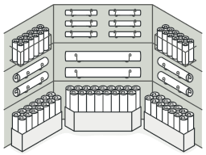

# Padrões de Projeto (Design Patterns) com Python

<p align="center">
  
</p>

Este repositório é um espaço de estudo e prática dedicado à implementação de Padrões de Projeto (Design Patterns) utilizando a linguagem Python. O objetivo é fornecer exemplos claros e funcionais que demonstrem a proposta de valor de cada padrão em cenários práticos.

## O que são Padrões de Projeto?

Padrões de Projeto são soluções reutilizáveis para problemas comuns que ocorrem no desenvolvimento de software. Eles não são códigos prontos, mas sim modelos ou descrições de como estruturar classes e objetos para resolver um determinado tipo de problema de forma eficiente, flexível e de fácil manutenção.

## Estrutura do Repositório

Cada padrão de projeto explorado está contido em seu próprio diretório. A estrutura foi pensada para ser autoexplicativa:

```
/
|-- AbstractFactory/
|   |-- ... (implementação do padrão Abstract Factory)
|
|-- Factory/
|   |-- ... (implementação do padrão Factory Method)
|
|-- (Outros Padrões)/
```

Dentro de cada diretório, você encontrará os arquivos Python que compõem a implementação do padrão, geralmente com um arquivo `main.py` que demonstra seu uso.

## Como Executar os Exemplos

Para executar e ver um padrão em ação, navegue até o diretório raiz do projeto (`python_exercicios_iniciante`) e utilize o seguinte comando, substituindo `NomeDoPadrao` pelo nome do diretório do padrão que deseja executar:

```bash
python -m NomeDoPadrao.main
```

Por exemplo, para executar o padrão **Abstract Factory**:

```bash
python -m AbstractFactory.main
```

## Padrões Incluídos

Atualmente, este repositório inclui exemplos para os seguintes padrões:

- **Abstract Factory:** Fornece uma interface para criar famílias de objetos relacionados ou dependentes sem especificar suas classes concretas.
- **Factory Method:** Define uma interface para criar um objeto, mas deixa as subclasses decidirem qual classe instanciar.

## Nota Sobre Reaproveitamento Entre Padrões

Neste momento do estudo, o exemplo de **Abstract Factory** está **propositalmente acoplado** ao domínio de livros do exemplo de **Factory Method** para demonstrar reutilização de classes entre módulos (`Factory` e `AbstractFactory`).

Esse acoplamento foi adotado apenas como prática de reaproveitamento nesta fase de treino. Nos próximos padrões, a proposta é manter os exemplos desacoplados para reforçar o estudo isolado de cada padrão.

Este é um projeto em contínuo desenvolvimento. Novos padrões serão adicionados com o tempo.

Sinta-se à vontade para explorar, executar e modificar os códigos para aprofundar seu entendimento!
